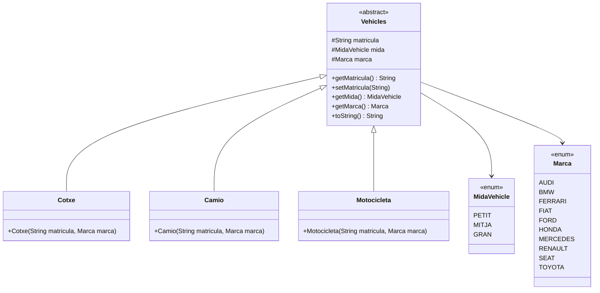
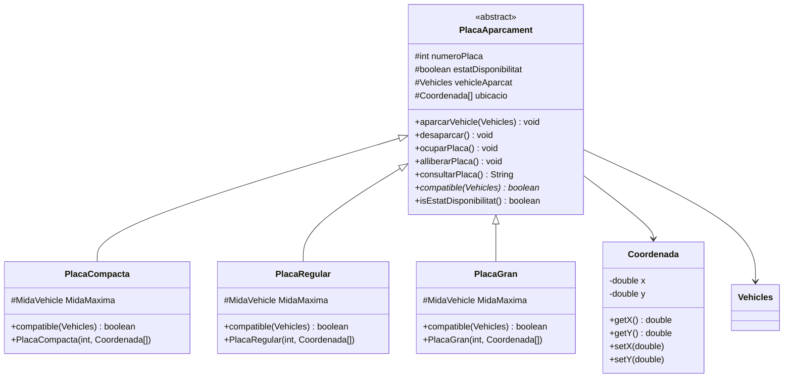
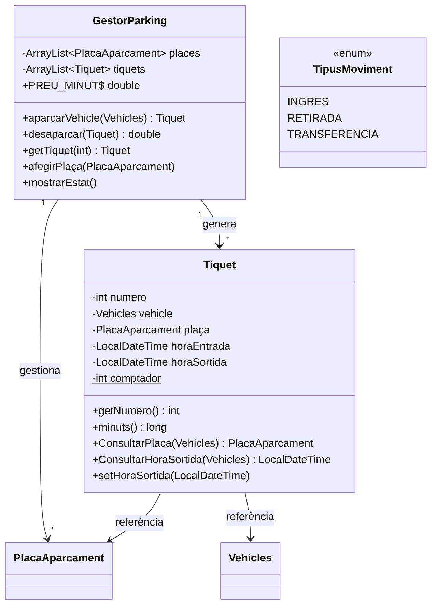
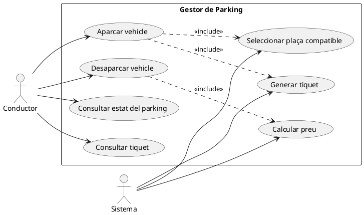

# 🅿️ Gestor de Parking

Sistema de gestió d'aparcament desenvolupat en Java. Permet aparcar i desaparcar vehicles en places de diferents mides, generant tiquets amb càlcul automàtic del preu.

---

## 📐 Diagrames de Classes

### 🚗 Vehicles



---

### 🅿️ Places d'Aparcament



> **Compatibilitat de places:**
> | Tipus | PETIT | MITJA | GRAN |
> |---|:---:|:---:|:---:|
> | `PlacaCompacta` | ✅ | ❌ | ❌ |
> | `PlacaRegular` | ✅ | ✅ | ❌ |
> | `PlacaGran` | ✅ | ✅ | ✅ |

---

### 🎫 Tiquets i Gestor



---

## 🔄 Diagrama de Casos d'Ús



> 💡 **Nota:** Renderitza el diagrama PlantUML a [https://www.plantuml.com/plantuml/uml/](https://www.plantuml.com/plantuml/uml/) o instal·la l'extensió **PlantUML** a VS Code.

---

## 🏗️ Estructura del Projecte

```
src/
└── dam/
    └── com/
        ├── GestorParking.java
        ├── Places/
        │   ├── PlacaAparcament.java   ← abstracta
        │   ├── PlacaCompacta.java
        │   ├── PlacaRegular.java
        │   ├── PlacaGran.java
        │   └── Coordenada.java
        ├── Tickets/
        │   └── Tiquet.java
        └── vehicles/
            ├── Vehicles.java          ← abstracta
            ├── Cotxe.java
            ├── Camio.java
            ├── Motocicleta.java
            ├── Marca.java
            └── MidaVehicle.java
```

---

## ⚙️ Funcionament

1. Es crea un `GestorParking` amb una llista de places (`PlacaCompacta`, `PlacaRegular`, `PlacaGran`).
2. Es crida `aparcarVehicle(vehicle)` → el gestor busca la primera plaça compatible i genera un `Tiquet`.
3. Per desaparcar, es crida `desaparcar(tiquet)` → s'allibera la plaça i es calcula el preu: `minuts × 2,0 €/minut`.